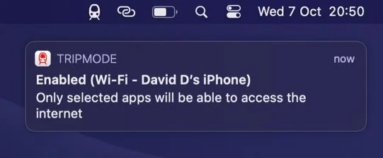
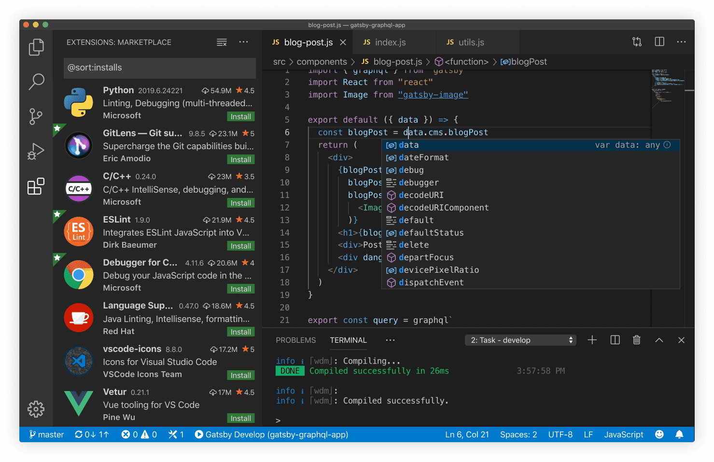
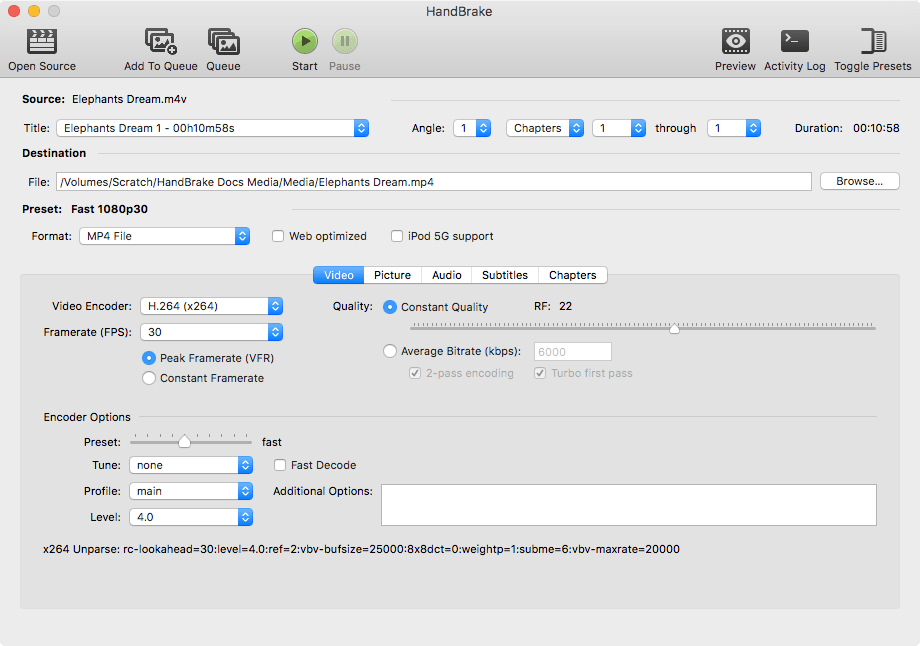

<!-- markdownlint-disable -->

  <!-- github-banner-start -->
    <h1>Tools I use</h1>
  <!-- github-banner-end -->

<!-- markdownlint-restore -->

<!-- tag definitions -->
<!-- usage: ![mytag]  https://shields.io/badges -->

[oss]: https://img.shields.io/badge/pricing-open--source-green
[free]: https://img.shields.io/badge/pricing-free-yellow
[macos]: https://img.shields.io/badge/-macOS-000?logo=apple
[commercial]: https://img.shields.io/badge/pricing-commercial-orange

<h2>📒 Contents</h2>

- [💽 Software](#-software)
  - [🖥️ Desktop (macOS)](#️-desktop-macos)
    - [🖱️ OS Enhancements](#️-os-enhancements)
    - [🧑‍💻 Software Development](#-software-development)
    - [🗒️ Productivity](#️-productivity)
    - [🤖 Misc](#-misc)
  - [📱 Mobile (iOS)](#-mobile-ios)
  - [🌐 Around the Web](#-around-the-web)
  - [🤔 Want to try](#-want-to-try)
- [🛠️ Hardware](#️-hardware)

<!-- TODO: check out https://github.com/jaywcjlove/awesome-mac  -->
<!-- TODO: use more funny words https://www.slangthesaurus.com/synonyms/excited  -->

## 💽 Software

### 🖥️ Desktop (macOS)

#### 🖱️ OS Enhancements

![macos]

| Name                                                                           | Description                                                                              | Image                                                                                                                                                                                                                                                  |
|--------------------------------------------------------------------------------|------------------------------------------------------------------------------------------|--------------------------------------------------------------------------------------------------------------------------------------------------------------------------------------------------------------------------------------------------------|
| [Clipy](https://github.com/Clipy/Clipy)          ![oss]                        | Clipboard manager: `ctrl-shift-v` and you see all the stuff you copied to the clipboard. |                                                          |
| [AltTab](https://github.com/lwouis/alt-tab-macos)![oss]                        | Alternative app switcher that previews the windows like in some other OSes.              |                                                                                                                                                                                  |
| [ShiftIt](https://github.com/fikovnik/ShiftIt)   ![oss]                        | Allows to change window size and position via shortcuts.                                 |  |
| [Dozer](https://github.com/Mortennn/Dozer)       ![oss]                        | Hides macOS menu bar icons.                                                              |                                                                                                                                                                                   |
| [Alfred](https://www.alfredapp.com)              ![oss]                        | Alternative to .                                                                         |                                                                                                                                                                            |
| [iStat Menus](https://bjango.com/mac/istatmenus/) ![commercial]                |                                                                                          |                                                                                                                                                                                                                                                        |
| [TripMode](https://tripmode.ch)                  ![commercial]                 | Data usage tracker and limiter - helpful when abroad and/or using a mobile hotspot.      |                                                                                                                                                                                                        |
| [QuickLook Plugins](https://github.com/sindresorhus/quick-look-plugins) ![oss] | QuickLook plugins for various file formats.                                              |                                                                                                                                                                                                                                                        |
|                                                                                |                                                                                          |                                                                                                                                                                                                                                                        |

<!-- | Apple Keychain                                    | Password manager by Apple.                                                          |                                                                                                                                                                                                                                                        | ![commercial] |
| Apple HideMyEmail                                 | Apple's email privacy feature.                                                      |                                                                                                                                                                                                                                                        | ![commercial] | -->

#### 🧑‍💻 Software Development

| Name                                                       | Description                                                                                                                                                                              | Image                                                                                                           |
|------------------------------------------------------------|------------------------------------------------------------------------------------------------------------------------------------------------------------------------------------------|-----------------------------------------------------------------------------------------------------------------|
| [iTerm2](https://iterm2.com)             ![oss]            | Alternative to macOS's own _Terminal_. It has a lot more features and customization options.                                                                                             |  |
| [Fork](https://git-fork.com)           ![free]             | GUI Git client that I use for non trivial git actions, because I find it harder to make mistakes. Also, it makes it a breeze to commit only certain parts of a file's changes. :rocket:. |                                                                  |
| [Trailer](https://ptsochantaris.github.io/trailer/) ![oss] | Menubar item that notifies about GitHub notifications.                                                                                                                                   |                                                                                      |
| [VSCode](https://code.visualstudio.com) ![free]            | Code editor - if you have not heard of it, you probably don't need it 🙃.                                                                                                                 |                                                                                       |
|                                                            |                                                                                                                                                                                          |                                                                                                                 |

#### 🗒️ Productivity

| Name                                                      | Description                                                                                                                                                                                                                                                           | Image |
|-----------------------------------------------------------|-----------------------------------------------------------------------------------------------------------------------------------------------------------------------------------------------------------------------------------------------------------------------|-------|
| [Things 3](https://culturedcode.com/things/)![commercial] | For me, hands-down the best Task manager. Being able to just hit `ctrl-space` and type to add a new To Do still feels, after years, like a super power.                                                                                                               |       |
| [Spark 2](https://sparkmailapp.com/spark2)  ![free]       | Email client - I think I chose this one years ago because I could customize the keyboard-shortcuts.. Have been very happy with it for years.. (I could not find my way around their new version - I assume I was not the only one since they keep the old one around) |       |
|                                                           |                                                                                                                                                                                                                                                                       |       |

#### 🤖 Misc

| Name                                       | Description                                                                                         | Image                                       |
|--------------------------------------------|-----------------------------------------------------------------------------------------------------|---------------------------------------------|
| [Handbrake](https://handbrake.fr)  ![oss]  | You want to convert so media files? Use this. Its like a GUI for `ffmpeg`.                          |           |
| [ImageOptim](https://imageoptim.com)![oss] | Removes bloated metadata. Saves disk space & bandwidth by compressing images without losing quality |  |
| [Tunnelblick](https://tunnelblick.net/)    |                                                                                                     |                                             |
|                                            |                                                                                                     |                                             |

### 📱 Mobile (iOS)

| Name                                                                              | Description                                                                                                                                              | Image |
|-----------------------------------------------------------------------------------|----------------------------------------------------------------------------------------------------------------------------------------------------------|-------|
| [Things 3 (iOS)](https://culturedcode.com/things/iphone/appstore/)  ![commercial] | Mobile version that syncs with the desktop version. For me the key feature is the widget, which shows Today's Tasks and has a button to add a new To Do. |       |
| [Carrot Weather](https://www.meetcarrot.com/weather/)               ![commercial] | Weather app that is also funny.                                                                                                                          |       |
|                                                                                   |                                                                                                                                                          |       |

<!--|            | Shortcuts     automation app. |       | ![ios] | -->

### 🌐 Around the Web

| Name                                                                    | Description | Image |
|-------------------------------------------------------------------------|-------------|-------|
| [slangthesaurus](https://www.slangthesaurus.com/synonyms/tool)  ![free] |             |       |
|                                                                         |             |       |

### 🤔 Want to try

| Name                                                            | Description | Image |
|-----------------------------------------------------------------|-------------|-------|
| [Iconology](https://github.com/liamrosenfeld/Iconology)  ![oss] |             |       |
| [`tbls`](https://github.com/k1LoW/tbls)                         |             |       |
|                                                                 |             |       |

## 🛠️ Hardware

`TODO`

- 🖥️ Computer: _iMac M1 24" (2021)_
- 📷 Camera: _FujiFilm X-T30 ii_
- 📓 Notetaking: _Onyx Boox Note Air 2_

<!-- ### Home Improvement Tools

| Name   | Description           | Image | Tags |
|--------|-----------------------|-------|------|
| Tool 6 | Description of Tool 6 |       |      |
| Tool 7 | Description of Tool 7 |       |      |

### Gardening Tools

| Name   | Description           | Image | Tags |
|--------|-----------------------|-------|------|
| Tool 8 | Description of Tool 8 |       |      |
| Tool 9 | Description of Tool 9 |       |      |
-->
<!--

TODO/Ideas
- https://git.herrbischoff.com/awesome-macos-command-line/about/
- Add a section for "Tools I want to buy"
- Add a section for "Tools I have bought but don't use" (?)
- maybe create separate repo for stuff I like (so movies, music etc.)

funkengrooven
-->
