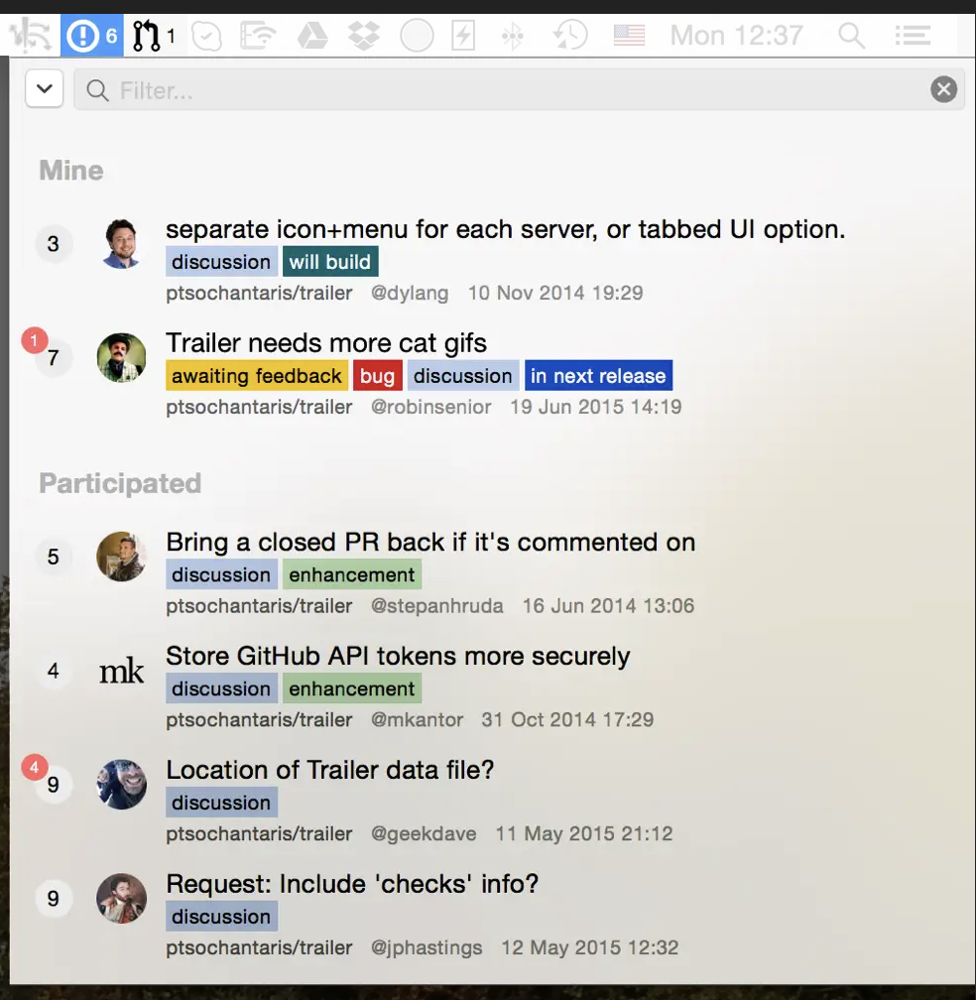
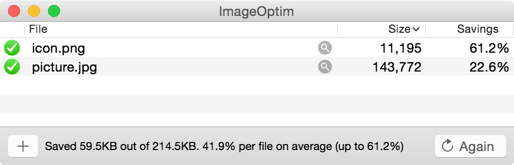

<!-- markdownlint-disable -->

  <!-- github-banner-start -->
    <h1>Tools</h1>
  <!-- github-banner-end -->

<!-- markdownlint-restore -->

<!-- tag definitions -->
<!-- usage: ![mytag]  https://shields.io/badges -->

[oss-badge]: https://img.shields.io/badge/pricing-open--source-green
[free-badge]: https://img.shields.io/badge/pricing-free-yellow
[commercial-badge]: https://img.shields.io/badge/pricing-commercial-orange

<h2>📒 Contents</h2>

1. [🖥️ Software](#️-software)
   1. [🖱️ macOS Enhancements](#️-macos-enhancements)
   2. [🧑‍💻 Software Development](#-software-development)
   3. [🗒️ Productivity](#️-productivity)
   4. [🤖 Misc](#-misc)
2. [📱 Apps (iOS)](#-apps-ios)
3. [🌐 Around the Web](#-around-the-web)

<!-- TODO: use more funny words https://www.slangthesaurus.com/synonyms/excited  -->

<!-- ## 📟 Devices

`TODO`

- 🖥️ Computer: _iMac M1 24" (2021)_
- 📷 Camera: _FujiFilm X-T30 ii_
- 📓 Notetaking: _Onyx Boox Note Air 2_ -->

## 🖥️ Software

### 🖱️ macOS Enhancements

<!-- TODO: check out https://github.com/jaywcjlove/awesome-mac  -->
<!-- ![macos-badge] -->

| Name                                                                     | Description                                                                              | Image                                                                                      |
|--------------------------------------------------------------------------|------------------------------------------------------------------------------------------|--------------------------------------------------------------------------------------------|
| [Clipy](https://github.com/Clipy/Clipy)          ![oss-badge]            | Clipboard manager: `ctrl-shift-v` and you see all the stuff you copied to the clipboard. | 
 
 |
| [AltTab](https://github.com/lwouis/alt-tab-macos)![oss-badge]            | Alternative app switcher that previews the windows like in some other OSes.              |                      |
| [Hammerspoon](https://github.com/Hammerspoon/hammerspoon)   ![oss-badge] | Allows to change window size and position via shortcuts.                                 |                                                                                            |

| [Dozer](https://github.com/Mortennn/Dozer)       ![oss-badge]                                 | Hides macOS menu bar icons.                                                                                              |                                                                  |
| [Dyet](https://inchman.gumroad.com/l/Dyet)              ![free-badge]                         | Folder Colors based on Tags                                                                                              |                                                                                                             |
| [iStat Menus](https://bjango.com/mac/istatmenus/) ![commercial-badge]                         |                                                                                                                          |
| [FavMan](https://github.com/shy-neon/Favman/) ![oss-badge]                                    | Favman allows you to quickly and easily customize favicons, by just dropping in your custom icons.                       |                   |
| [TripMode](https://tripmode.ch)                  ![commercial-badge]                          | Data usage tracker and limiter - helpful when abroad and/or using a mobile hotspot.                                      |                                                                                       |
| [RightMenu Master](https://wangchujiang.com/rightmenu-master/)                  ![free-badge] | RightMenu Master is a powerful Finder right-click menu enhancement tool designed to improve the efficiency of Mac users. |  |
| [QuickLook Plugins](https://github.com/sindresorhus/quick-look-plugins) ![oss-badge]          | QuickLook plugins for various file formats.                                                                              |                                                                                                                                       |
|                                                                                               |                                                                                                                          |                                                                                                                                       |

<!-- | Apple Keychain                                    | Password manager by Apple.                                                          |                                                                                                                                                                                                                                                        | ![commercial-badge] |
| Apple HideMyEmail                                 | Apple's email privacy feature.                                                      |                                                                                                                                                                                                                                                        | ![commercial-badge] | -->

### 🧑‍💻 Software Development

| Name                                                             | Description                                                                                                                                                                              | Image                                                                                                           |
|------------------------------------------------------------------|------------------------------------------------------------------------------------------------------------------------------------------------------------------------------------------|-----------------------------------------------------------------------------------------------------------------|
| [iTerm2](https://iterm2.com)             ![oss-badge]            | Alternative to macOS's own _Terminal_. It has a lot more features and customization options.                                                                                             |  |
| [Fork](https://git-fork.com)           ![free-badge]             | GUI Git client that I use for non trivial git actions, because I find it harder to make mistakes. Also, it makes it a breeze to commit only certain parts of a file's changes. :rocket:. |                                                                  |
| [Trailer](https://ptsochantaris.github.io/trailer/) ![oss-badge] | Menubar item that notifies about GitHub notifications.                                                                                                                                   | 

                                                    |
| [VSCode](https://code.visualstudio.com) ![free-badge]            | Code editor - if you have not heard of it, you probably don't need it 🙃.                                                                                                                 |                                                                                       |
|                                                                  |                                                                                                                                                                                          |                                                                                                                 |

### 🗒️ Productivity

| Name                                                            | Description                                                                                                                                             | Image |
|-----------------------------------------------------------------|---------------------------------------------------------------------------------------------------------------------------------------------------------|-------|
| [Things 3](https://culturedcode.com/things/)![commercial-badge] | For me, hands-down the best Task manager. Being able to just hit `ctrl-space` and type to add a new To Do still feels, after years, like a super power. |       |
| [Tailscale](https://tailscale.com)       ![free-badge]          |                                                                                                                                                         |       |
|                                                                 |                                                                                                                                                         |       |

### 🤖 Misc

| Name                                             | Description                                                                                         | Image                                       |
|--------------------------------------------------|-----------------------------------------------------------------------------------------------------|---------------------------------------------|
| [Handbrake](https://handbrake.fr)  ![oss-badge]  | You want to convert so media files? Use this. Its like a GUI for `ffmpeg`.                          |           |
| [IINA](https://github.com/iina/iina)![oss-badge] | Video player                                                                                        |   |
| [ImageOptim](https://imageoptim.com)![oss-badge] | Removes bloated metadata. Saves disk space & bandwidth by compressing images without losing quality |  |
| [Tunnelblick](https://tunnelblick.net/)          |                                                                                                     |                                             |
|                                                  |                                                                                                     |                                             |

<!-- 
### 🤔 Want to try

| Name                                                                  | Description | Image |
|-----------------------------------------------------------------------|-------------|-------|
| [Iconology](https://github.com/liamrosenfeld/Iconology)  ![oss-badge] |             |       |
| [`tbls`](https://github.com/k1LoW/tbls)                               |             |       |
|                                                                       |             |       |  | --> |

## 📱 Apps (iOS)

| Name                                                                                    | Description                                                                                                                                              | Image                                                                                  |
|-----------------------------------------------------------------------------------------|----------------------------------------------------------------------------------------------------------------------------------------------------------|----------------------------------------------------------------------------------------|
| [Things 3 (iOS)](https://culturedcode.com/things/iphone/appstore/)  ![commercial-badge] | Mobile version that syncs with the desktop version. For me the key feature is the widget, which shows Today's Tasks and has a button to add a new To Do. |  |
| [Carrot Weather](https://www.meetcarrot.com/weather/)               ![commercial-badge] | Weather app that is also funny.                                                                                                                          |                    |
|                                                                                         |                                                                                                                                                          |                                                                                        |

<!--|            | Shortcuts     automation app. |       | ![ios] | -->

## 🌐 Around the Web

| Name                                                                              | Description                                                                                                                 | Image                                             |
|-----------------------------------------------------------------------------------|-----------------------------------------------------------------------------------------------------------------------------|---------------------------------------------------|
| [slangthesaurus.com](https://www.slangthesaurus.com/synonyms/tool)  ![free-badge] | Yoked language extensions to bamboozle and confoozle the plebes, flex skilz mid convo, and smooth your verbal _ForSerious_! |  |
|                                                                                   |

<!-- ### Home Improvement Tools

| Name   | Description           | Image | Tags |
|--------|-----------------------|-------|------|
| Tool 6 | Description of Tool 6 |       |      |
| Tool 7 | Description of Tool 7 |       |      |

### Gardening Tools

| Name   | Description           | Image | Tags |
|--------|-----------------------|-------|------|
| Tool 8 | Description of Tool 8 |       |      |
| Tool 9 | Description of Tool 9 |       |      |
-->
<!--

TODO/Ideas
- https://git.herrbischoff.com/awesome-macos-command-line/about/
- Add a section for "Tools I want to buy"
- Add a section for "Tools I have bought but don't use" (?)
- maybe create separate repo for stuff I like (so movies, music etc.)

funkengrooven
-->

<h2> License </h2>

<!-- <svg fill="none" viewBox="0 0 800 400" width="800" height="400" xmlns="https://www.w3.org/2000/svg">
  <foreignObject width="100%" height="100%">
    

      
      

    

  </foreignObject>
</svg> -->
